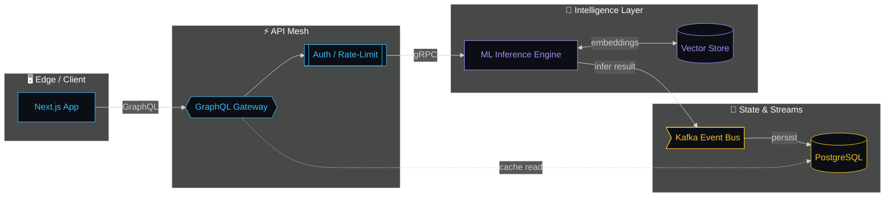
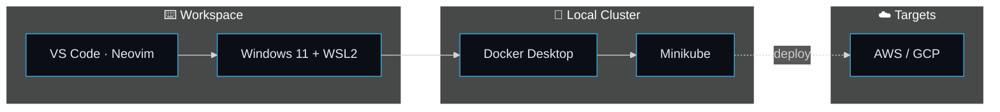

<!-- ============ LIVED-IN BLUEPRINT · COMMAND CENTER ============ -->

<h1 align="center">
  <code>&lt; Cuma Doğan / System Architect &gt;</code>
</h1>

  <em>Kutu çizmiyorum — sistem akışı tasarlıyorum.</em> 
  AI Engineering · Distributed Systems · Real-Time Data Pipelines

<!-- LIVE DATA FLOW HEADER -->

  

---

## 🧭 System Command Center

---

## 🛰️ Project Pods

<table>
<tr>
<td width="50%" valign="top">

### 🧠 NeuroScan · Medical Imaging AI

**Flow:** `DICOM → Flask → TensorFlow CNN → Grad-CAM`

 
⚡ 94% accuracy · 120ms inference · Grad-CAM explainability

</td>
<td width="50%" valign="top">

### 📈 QuantForge · Algo Trading Engine

**Flow:** `Market Feed → C++ Ingestor → Python Signals → MQL5 Exec`

 
⚡ sub-ms tick processing · risk-gated execution · backtested

</td>
</tr>
</table>

---

## ⚙️ Capability Reactors

<table>
<tr>
<td width="50%" align="center" valign="top">
<b>System Efficiency</b> 

</td>
<td width="50%" align="center" valign="top">
<b>Cloud Autoscaling</b> 

</td>
</tr>
</table>

---

## 🛠️ Workspace Architecture

---

## 📡 Telemetry · Hologram Panels

<table>
<tr>
<td>

</td>
<td>

</td>
</tr>
</table>

  // Projects are not isolated — they are nodes of the same engineering philosophy.

