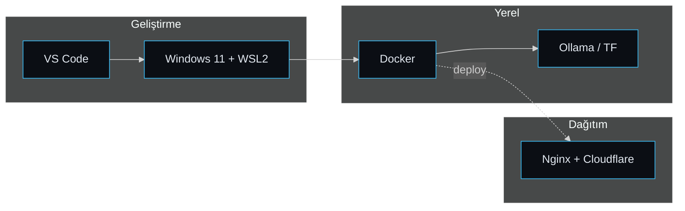

<!-- ============ LIVED-IN BLUEPRINT ============ -->

<h1 align="center">Cuma Doğan</h1>

  Yapay zekâ, dağıtık sistemler ve veri hatları üzerine çalışıyorum. 
  Projelerimi uçtan uca kuruyorum — modelden arayüze, container'dan deploy'a kadar.

  

  
  
  
  
  
  
  
  

---

## Öne çıkan projeler

Aşağıdaki üçü, kendi projelerimden mimari olarak en çok uğraştıklarım. Her birinin küçük, hareketli akış şeması yanında.

<table>
<tr>
<td valign="top">

### 🩺 Akıllı Tıbbi Görüntü Analiz Sistemi

CT, MR ve röntgen görüntülerini EfficientNetV2-M tabanlı bir modelle işleyip hekime ön tanı desteği veren platform. DICOM ön işleme hattı, rol bazlı erişim (doktor / radyolog / akademisyen) ve Cloudflare → Nginx → Docker → Flask şeklinde konumlandırılmış bir servis katmanı içeriyor.

Python · TensorFlow/Keras · Flask · OpenCV · Supabase · Docker

</td>
</tr>
<tr>
<td valign="top">

### 🧪 StandAi — Sentetik Tüketici Paneli

Bir reklam ya da ürün metnini, TÜİK demografisine göre katmanlı örneklenmiş ~1000 sentetik persona üzerinde test eden B2B araç. Celery + Redis ile kuyruğa alınan istekler Gemini Flash'a toplu (10 persona/çağrı) gidiyor; sonuçlar pgvector (768D) ile anlamsal olarak kümeleniyor. Tam bir test ~12 dakikada tamamlanıyor.

Next.js · FastAPI · Celery/Redis · pgvector · Google Generative AI · Docker Compose

</td>
</tr>
<tr>
<td valign="top">

### 🛡️ textSansür — Yerel KVKK Maskeleme

Metin ve görsellerdeki kişisel veriyi tamamen yerelde — buluta hiçbir şey göndermeden — maskeleyen araç. Ollama üzerinde qwen2.5:14b bağlamı çözüyor (örn. mağdurun adını maskeler, dolandırıcınınkini bırakır), EasyOCR görseldeki metni yakalıyor, tarayıcıdaki canvas editöründe blur/pixel/bant uygulanıyor.

Python · Ollama (qwen2.5) · EasyOCR · Flask · Docker · %0 bulut transferi

</td>
</tr>
</table>

---

## Diğer çalıştıklarım

| Proje | Ne yapıyor | Yığın |
|---|---|---|
| **myHackBot** | Komut allowlist'i ve enjeksiyon korumasıyla çalışan, araç çağıran etik (white-hat) güvenlik asistanı | Python · Ollama · Tkinter · faster-whisper |
| **claude_sohbet** | SIR/SEIR modeliyle salgın yayılımını simüle eden ve canlı grafikleyen panel | Next.js · FastAPI · Recharts |
| **screenEnergy** | Çok monitörlü kurulumlarda poz tespitine göre ekran/enerji yönetimi | Python · MediaPipe · OpenCV |
| **akaryakit-listeleme** | Türkiye akaryakıt fiyatlarını harita üzerinde karşılaştıran MVP | Next.js 14 · Leaflet · Tailwind |
| **FIRATHUB2** | Üniversite içi akademisyen–öğrenci eşleştirme ve işbirliği platformu | Web · AI öneri |

---

## Nasıl çalışıyorum

Tek bir desen üç projede de tekrar ediyor: ince bir arayüz, işi yapan bir API katmanı, arkada bir model (yerel ya da bulut) ve durumun yaşadığı bir veritabanı. Çoğunu Docker'la paketleyip kendi sunucuma alıyorum.

---

<table>
<tr>
<td>

</td>
<td>

</td>
</tr>
</table>

